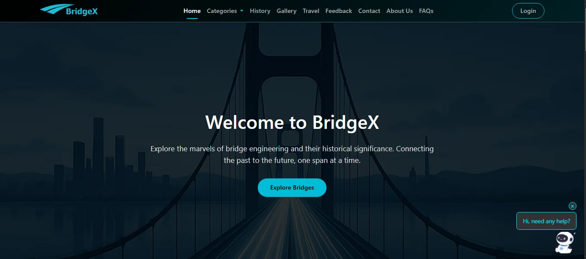

# BridgeX - Explore the World's Most Amazing Bridges



**BridgeX** is a comprehensive web platform dedicated to showcasing the world's most remarkable bridges, their engineering marvels, and historical significance. From the longest spans to the oldest structures still standing, BridgeX connects you to the fascinating world of bridge architecture and engineering.

## About the Project

BridgeX was founded in 2025 as a passion project by civil engineers and architecture enthusiasts. Our mission is to bridge the gap between technical knowledge and public appreciation of these magnificent structures that connect communities and shape our landscapes.

### Key Statistics (All Fake)
- **500+** Bridges Cataloged
- **75+** Countries Covered
- **10K+** Monthly Visitors
- **25+** Expert Contributors

---

## Features

### Comprehensive Bridge Categories
- **Longest Bridges**: Explore the world's most extensive bridge structures spanning great distances
- **Tallest Bridges**: Discover bridges that reach staggering heights above valleys and waterways
- **Highest Bridges**: View bridges built at extreme elevations above sea level
- **Oldest Bridges**: Journey through history with bridges that have stood the test of time

### Rich Content
- Detailed historical information about famous bridges worldwide
- Engineering breakthrough timelines from Roman arch bridges to modern smart bridges
- Beautiful image gallery with high-quality bridge photography
- Travel guides for visiting iconic bridges

### User Engagement
- Interactive feedback system
- Contact form for inquiries
- AI-powered chatbot for instant assistance
- FAQ section for common questions

### Modern Design
- Responsive Bootstrap 5 design
- Dark theme with professional aesthetics
- Smooth animations and transitions
- Mobile-friendly interface
- Font Awesome icons for enhanced UI

---

## Technology Stack

### Frontend
- **HTML5**: Semantic markup for better accessibility
- **CSS3**: Custom styling with modern design principles
- **JavaScript**: Interactive functionality
- **Bootstrap 5.3.5**: Responsive grid system and components
- **Font Awesome 6.4.0**: Icon library for visual enhancements

### External Integrations
- **Chatling AI**: Embedded chatbot for user support (ID: 6762866872)

---

## Project Structure

```
BridgeX/
├── index.html                 # Home page - main landing page
├── about.html                 # About Us - team and mission
├── contact.html               # Contact form and information
├── faq.html                   # Frequently asked questions
├── feedback.html              # User feedback form
├── gallery.html               # Bridge image gallery
├── history.html               # Detailed bridge history
├── login.html                 # User login page
├── travel.html                # Travel guides for bridges
├── sitemap.html               # Site navigation map
├── privacypolicy.html         # Privacy policy
├── termsandservice.html       # Terms of service
├── longestbridges.html        # Longest bridges category
├── tallestbridges.html        # Tallest bridges category
├── highestbridges.html        # Highest bridges category
├── oldestbridges.html         # Oldest bridges category
├── css/                       # Stylesheets directory
│   ├── index.css
│   ├── about.css
│   ├── contact.css
│   ├── gallery.css
│   ├── history.css
│   ├── login.css
│   ├── travel.css
│   ├── feedback.css
│   ├── faq.css
│   ├── longestbridges.css
│   ├── tallestbridges.css
│   ├── highestbridges.css
│   ├── oldestbridges.css
│   ├── sitemap.css
│   ├── privacypolicy.css
│   └── termsandservice.css
├── images/                    # Image assets directory
│   ├── bridgelogo1.png       # Site logo
│   ├── bridgeicon.png        # Favicon
│   ├── readme.PNG            # README preview image
│   └── [70+ bridge images]   # Bridge photographs
├── js/                        # JavaScript files
└── pdfs/                      # PDF documents
```

---

## Pages Overview

### Home Page (`index.html`)
The landing page features:
- Hero section with welcome message
- Engineering breakthroughs timeline (100 BCE - 2024)
- Bridge categories showcase with featured images
- Historical bridge highlights (London Bridge, Forth Bridge, Sydney Harbor Bridge)


### Categories Pages

#### Longest Bridges (`longestbridges.html`)
Showcases bridges spanning the greatest distances, including:
- Danyang-Kunshan Grand Bridge
- Tianjin Grand Bridge
- Weinan Weihe Grand Bridge
- Beijing Grand Bridge
- Lake Pontchartrain Causeway


#### Tallest Bridges (`tallestbridges.html`)
Features bridges with the highest structural height:
- Millau Viaduct
- Russky Bridge
- Sutong Yangtze River Bridge
- Stonecutters Bridge


#### Highest Bridges (`highestbridges.html`)
Displays bridges at extreme elevations:
- Duge Bridge
- Beipanjiang Bridge
- Sidu River Bridge
- Baluarte Bridge


#### Oldest Bridges (`oldestbridges.html`)
Historic bridges that have endured through time:
- Arkadiko Bridge (Greece, ~1300 BCE)
- Pons Fabricius (Rome, 62 BCE)
- Pont du Gard (France, ~19 BCE)
- Anji Bridge (China, 605 CE)


### History Page (`history.html`)
Comprehensive historical information about bridges from ancient civilizations to modern engineering, including:
- Roman bridge engineering
- Medieval European bridges
- Industrial Revolution innovations
- Modern suspension and cable-stayed bridges

### Gallery Page (`gallery.html`)
Beautiful collection of high-quality bridge photography from around the world, organized by categories and regions.

### Travel Page (`travel.html`)
Travel guides and visitor information for iconic bridges worldwide, including:
- Best viewing locations
- Visiting hours and access
- Photography tips
- Nearby attractions

### About Us Page (`about.html`)
Information about BridgeX, including:
- Company story and founding
- Mission and vision statements
- Team member profiles
- Platform statistics

### Contact Page (`contact.html`)
Contact form and information (dummy entries):
- Email: info@bridgex.com
- Phone: +92 123456789
- Social media links
- Contact form for inquiries

### Feedback Page (`feedback.html`)
User feedback form for suggestions and comments to improve the platform.

### FAQ Page (`faq.html`)
Frequently asked questions about:
- Bridge engineering
- Using the website
- Contributing information
- Historical accuracy

### Login Page (`login.html`)
User authentication for personalized features and saved preferences.

---

## Getting Started

### Prerequisites
- A modern web browser (Chrome, Firefox, Safari, Edge)
- Basic understanding of HTML/CSS (for development)
- Text editor or IDE (VS Code, Sublime Text, etc.)

### Installation

1. **Clone the repository**
   ```bash
   git clone https://github.com/Rutaab3/BridgeX.git
   ```

2. **Navigate to the project directory**
   ```bash
   cd BridgeX
   ```

3. **Open the project**
   - Simply open `index.html` in your web browser
   - Or use a local development server:

   ```bash
   # Using Python
   python -m http.server 8000

   # Using Node.js
   npx serve

   # Using PHP
   php -S localhost:8000
   ```

4. **Access the website**
   - Direct file: Open `index.html` in your browser
   - Local server: Navigate to `http://localhost:8000` in your browser

---

## Usage

### Exploring Bridges
1. Navigate to the home page
2. Click "Explore Bridges" or use the navigation menu
3. Select a category (Longest, Tallest, Highest, or Oldest)
4. Browse detailed information about each bridge

### Using the Chatbot
- The AI chatbot appears in the bottom-right corner
- Click to ask questions about bridges, navigation, or general inquiries
- Get instant responses powered by Chatling AI

### Submitting Feedback
1. Navigate to the Feedback page
2. Fill out the feedback form
3. Submit your suggestions or comments

### Contacting the Team
1. Go to the Contact page
2. Fill in your details and message
3. Submit the form to reach the BridgeX team

---

## Contributing

We welcome contributions from the community! Here's how you can help:

### Ways to Contribute
- **Add Bridge Information**: Submit details about bridges not yet in our database
- **Improve Documentation**: Enhance README or add wiki pages
- **Report Issues**: Submit bug reports or feature requests
- **Submit Photos**: Contribute high-quality bridge photography
- **Code Improvements**: Fix bugs or add new features

### Contribution Process
1. Fork the repository
2. Create a new branch (`git checkout -b feature/AmazingFeature`)
3. Make your changes
4. Commit your changes (`git commit -m 'Add some AmazingFeature'`)
5. Push to the branch (`git push origin feature/AmazingFeature`)
6. Open a Pull Request

---

## License

Copyright © 2025 BridgeX. All Rights Reserved.

See [Terms of Service](termsandservice.html) and [Privacy Policy](privacypolicy.html) for more information.

---

## Acknowledgments

- Bootstrap team for the excellent CSS framework
- Font Awesome for comprehensive icon library
- All contributors and bridge enthusiasts
- Civil engineers and architects who designed these magnificent structures
- Chatling AI for chatbot integration

---

## Quick Links

- [Live Website](https://rutaabali3.github.io/BridgeX) *(if deployed)*
- [Report Issues](https://github.com/rutaabali3/BridgeX/issues)
- [Suggest Features](https://github.com/rutaabali3/BridgeX/issues)

---

**Built with passion by the BridgeX Team | Connecting the past to the future, one span at a time.**
